# EasyDesk — Assistive Interaction System for Elderly Users

An assistive interaction system designed to help elderly users and people with limited digital literacy interact more easily with digital devices. The application combines:

- A physical large‑button keypad for simple, reliable input
- A gesture‑recognition module (MediaPipe + machine learning)
- An accessible, minimal interface with large icons and essential functions

Goals: provide a low‑friction, intuitive, and supportive user experience so seniors can communicate, access apps, read documents, navigate basic tasks, and maintain independence.

## Features
- Large‑button keypad integration for simple navigation and confirmation  
- Gesture recognition based on a temporal window of 3D hand landmarks and motion/posture features  
- Random Forest gesture classifier trained on custom datasets; models are stored in `models/`  
- Incremental dataset capture and retraining flow for improving the model  
- Lightweight, accessible UI for gallery, notes, PDF viewing and calendar functions

## Screenshots
Below are placeholders for screenshots — replace the paths with the correct relative paths or URLs to your captured images.

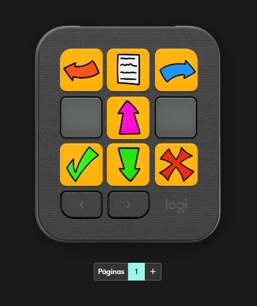
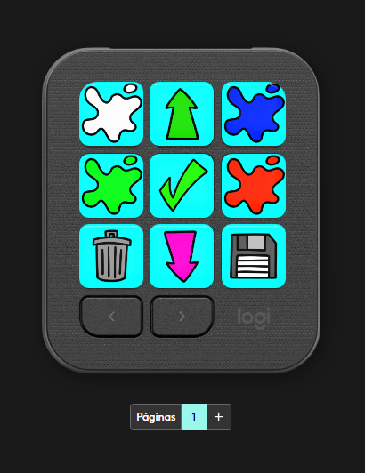
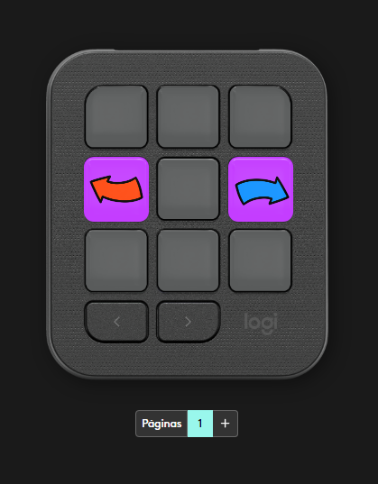
Gallery
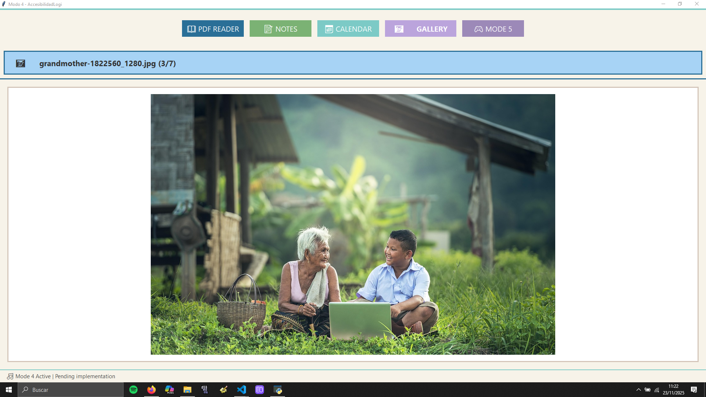
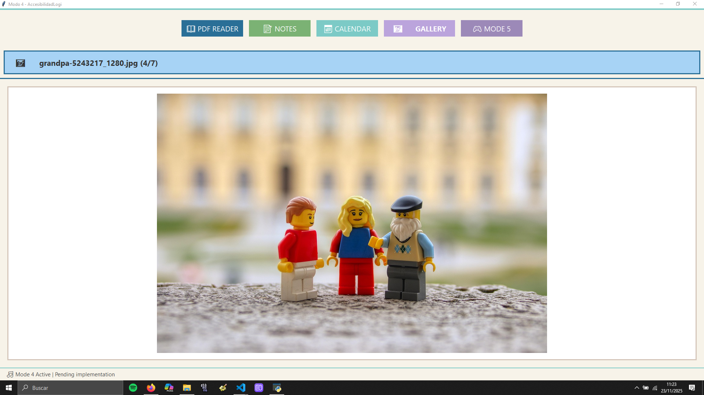
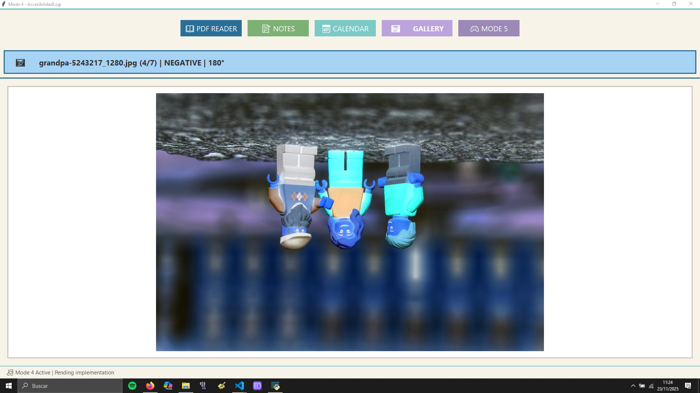
Notes
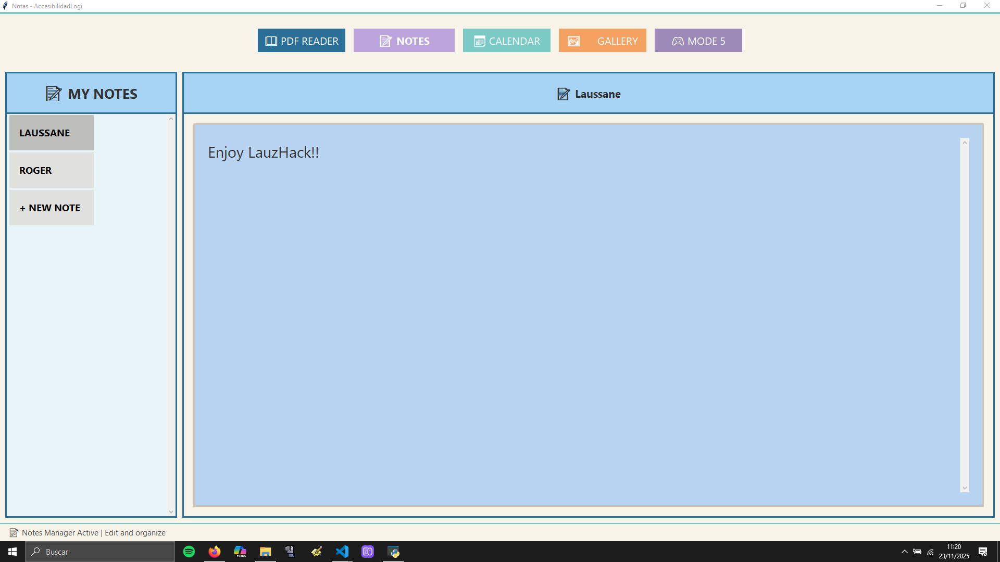
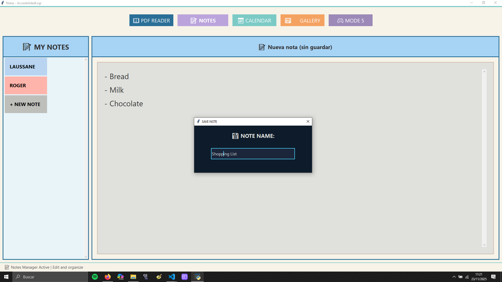
PDF Viewer
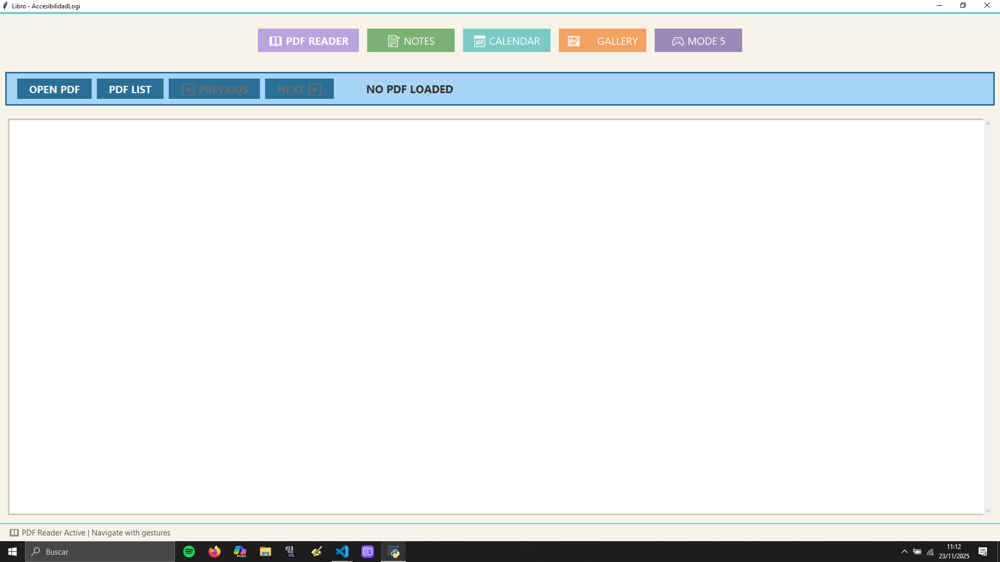
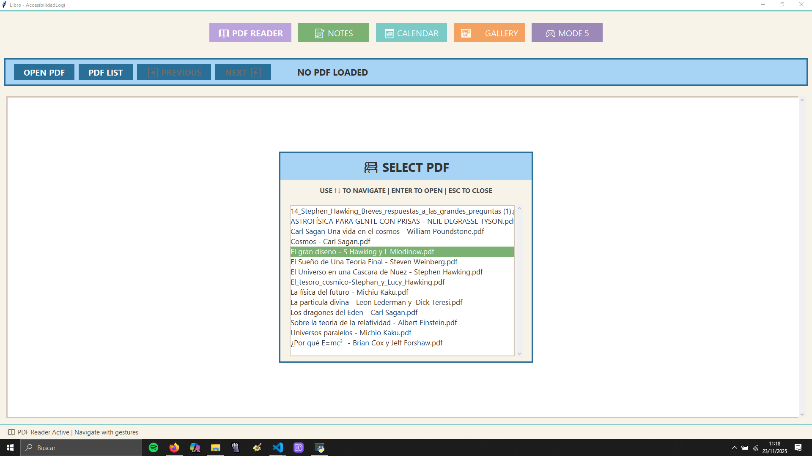
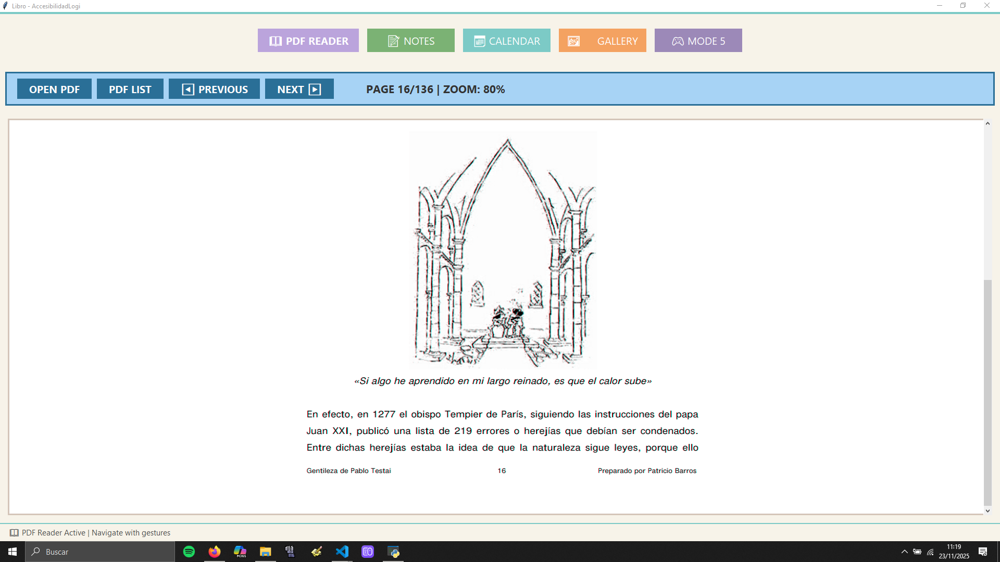
Calendar
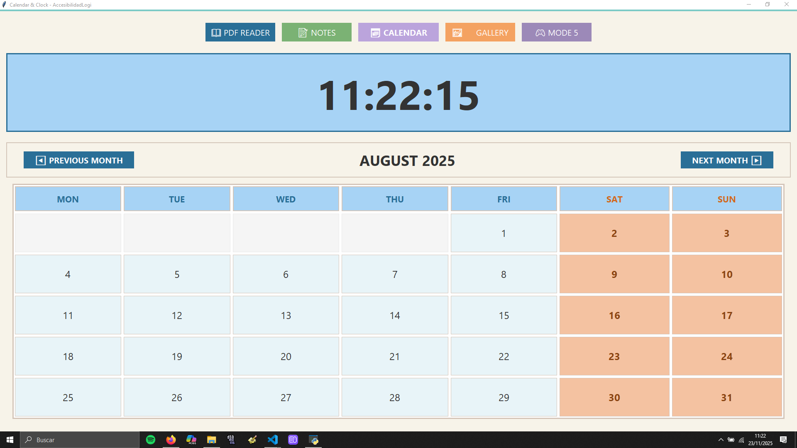

## Requirements
- Windows 10/11 (tested) or macOS / Linux with a UVC‑compatible webcam  
- Python 3.11 (recommended; 3.10+ should work)  
- pip (latest)  
- Disk space for dataset (`gesture_data/`) and models (`models/`) directories

## Installation

1. Clone the repository:

   git clone https://github.com/ELOIVI/lauzhack.git  
   cd lauzhack

   If the runnable app is under an `app/` subfolder, run the commands from `lauzhack/app` instead:

   cd app

2. Create and activate a virtual environment:

   python -m venv venv

   - Windows PowerShell:
       .\venv\Scripts\Activate.ps1
   - Windows CMD:
       .\venv\Scripts\activate.bat
   - macOS / Linux (bash/zsh):
       source venv/bin/activate

3. Upgrade pip and install dependencies:

   pip install --upgrade pip  
   pip install -r requirements.txt

4. Exit the virtual environment when finished:

   deactivate

## Project structure
- `gesture_detection/` – core detection module (detector, feature extraction)  
- `integration/` – application integration hooks  
- `api/` – FastAPI demo server  
- `gesture_data/` – labeled gesture samples (pkl files)  
- `models/` – trained ML model artifacts  
- `notebooks/` – dataset capture & training notebooks  
- `tests/` – CLI demos and test utilities

## Quick start
Run from the `app/` folder (if present) or the repo root where `main_*.py` files live:

   python main_viewer.py   # Live prediction viewer (developer/debug)  
   python main_app.py      # Full app with incremental dataset capture

## Incremental learning workflow
1. Capture new gesture samples using the provided capture utilities (see `notebooks/` or app UI).  
2. Verify new `.pkl` files appear under `gesture_data/`.  
3. Retrain the model:

   python train_model.py

4. Restart the app or API so the updated model is loaded.

## Library usage
Example usage from Python:

```python
from gesture_detection.detector import GestureDetector

detector = GestureDetector()
gesture, confidence, hand_detected, info = detector.process_frame(frame)
```

## Build executable (optional)
Use PyInstaller (example):

   pip install pyinstaller  
   pyinstaller --onefile main_app.py

Or replace with your preferred packaging tool.

## Contributing
Found a bug or want to help improve the README or code? Open an issue or a pull request in this repository.

## License & Contact
See the repository LICENSE file or contact the maintainers via GitHub issues.
